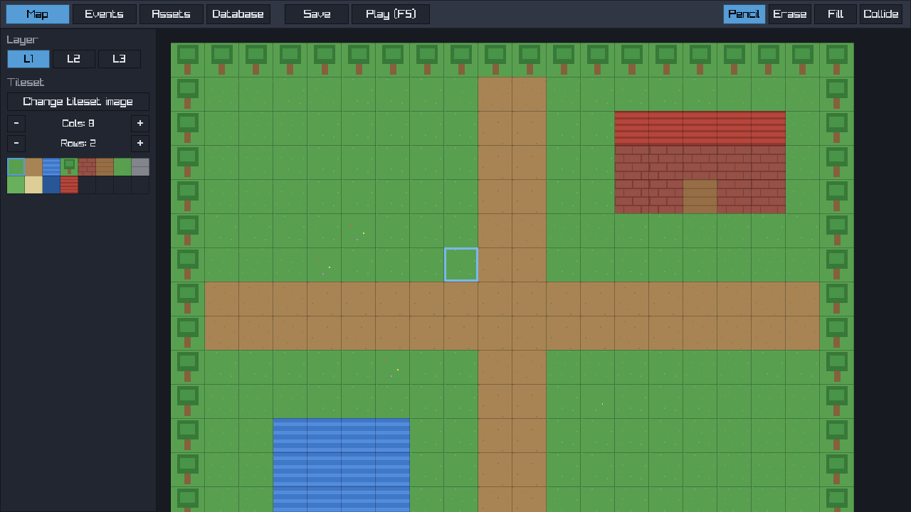
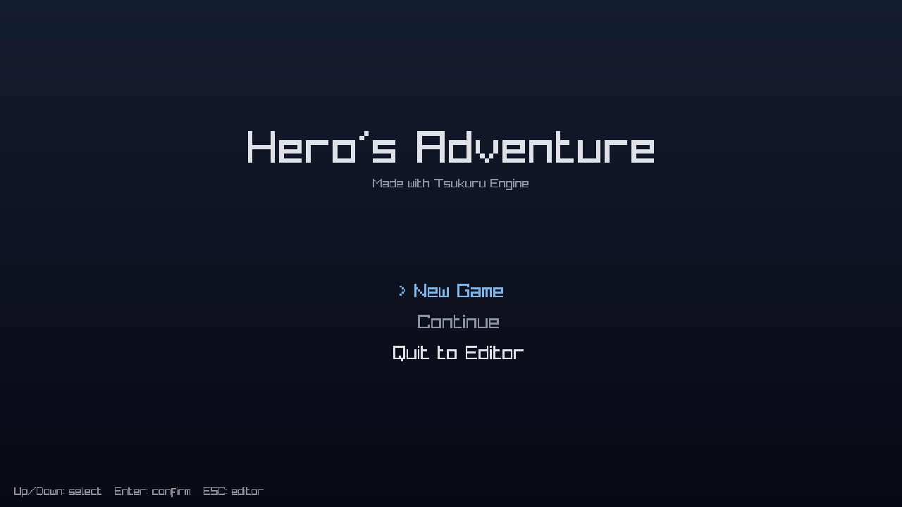
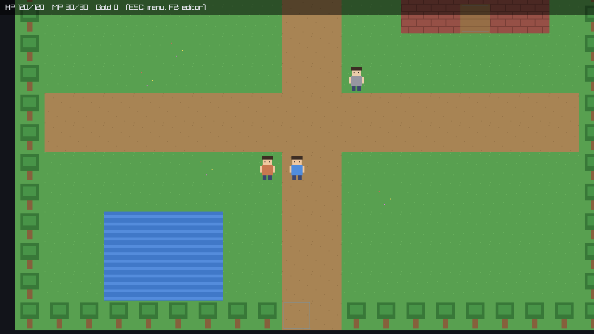

# Tsukuru Engine 🎮

A clean, optimized **2D RPG-Maker-style game engine** written in modern C++ (C++17)
on top of [raylib](https://www.raylib.com/). Launch the executable and you land
straight in the **editor** — build maps, register assets, edit the database, then
press **F5** to test-play your game with full character control. Make many
different RPGs with one tool.

| Editor | Title | Play |
|---|---|---|
|  |  |  |

---

## ✨ Features

**Engine / Editor**
- One executable = **editor + game runtime**. No separate player needed.
- **Tilemap editor**: 3 visual layers + a collision layer, with Pencil / Erase /
  Fill (bucket) tools, zoom & pan, live grid.
- **Asset registration**: drag & drop `.png` / `.wav` / `.ogg` onto the window to
  register them into the project (auto-copied + catalogued). Assign images as the
  tileset or the player sprite with one click.
- **Database editor**: Items, Equipment (weapons/armor), Skills, Actors, Enemies —
  add, edit stats, rename, all in-app.
- **Event system**: place events on tiles — Message, Teleport, Give Item,
  Set Switch, Start Battle, Shop. Triggers: Action button / Player touch / Autorun,
  with switch conditions and one-shot flags.
- Data-driven: everything saves to readable **JSON** (`project.json`,
  `database.json`, `maps/*.json`).

**Gameplay (the "commercial RPG-Maker" core)**
- Smooth grid-based movement, 4-direction character animation, collision.
- **Inventory** & gold, item use, **equipment** (weapon/armor) that changes stats.
- **Switches & variables** for game logic and progression.
- **Turn-based battle**: Attack / Skill / Item / Flee, damage formula, enemy AI,
  EXP & gold rewards, leveling.
- **Title screen** (New Game / Continue) and an in-game **menu**
  (Items / Equipment / Status / Save).
- **Save / Load** the full play state to JSON.

**Engineering**
- `tsukuru_core` is a **graphics-free logic library** → the whole game model is
  unit-tested headlessly (`tsukuru_selftest`, 32 checks).
- Release build uses `-O2` / `/O2` + link-time optimization; tile rendering, texture
  caching and contiguous `std::vector` storage keep it fast.

---

## 🚀 Quick start

### Windows
1. Install **CMake** and a C++ compiler (Visual Studio 2019/2022 with
   *Desktop development with C++*, or MinGW-w64).
2. Double-click **`build.bat`** (or run it in a terminal).
3. Run **`bin\TsukuruEngine.exe`** — it opens the editor with the sample game.

> Don't want to install a compiler? Push this repo to GitHub and the included
> **GitHub Actions** workflow builds `TsukuruEngine.exe` for you and uploads it as
> the `TsukuruEngine-Windows` artifact (see the *Actions* tab).

### Linux / macOS
```bash
./build.sh
./bin/TsukuruEngine
```
Build dependencies on Debian/Ubuntu:
```bash
sudo apt-get install -y libgl1-mesa-dev libxrandr-dev libxinerama-dev \
  libxcursor-dev libxi-dev libwayland-dev libxkbcommon-dev
```
(raylib and nlohmann/json are fetched automatically by CMake — internet needed on
first configure.)

---

## 🎼 Controls

**Editor**
| Action | Key / Mouse |
|---|---|
| Switch tab | Map / Events / Assets / Database buttons |
| Paint / select tile | Left click (palette to pick, canvas to draw) |
| Erase tile | Right click |
| Pan camera | Arrow keys or middle-mouse drag |
| Zoom | Mouse wheel |
| Save project | **Ctrl+S** (or *Save* button) |
| Test play | **F5** |
| Register assets | Drag files onto the window (Assets tab) |

**Play**
| Action | Key |
|---|---|
| Move | Arrow keys / WASD |
| Interact / confirm / advance text | Space or Enter |
| Open menu | ESC |
| Back to editor | **F2** |
| Battle | Up/Down select, Enter confirm, ESC back |

---

## 🛠 Make your own game

1. **Assets** tab → drag in your tileset/character PNGs. Click *Tileset* / *Player*
   to assign them.
2. **Map** tab → set tileset *Cols/Rows*, pick tiles, paint your world. Use the
   *Collide* tool to mark walls.
3. **Database** tab → create items, equipment, skills, your hero (Actor) and enemies.
4. **Events** tab → click tiles to add NPCs (Message), doors (Teleport), chests
   (Give Item), shops, and battles.
5. **Ctrl+S** to save, **F5** to play. Ship the `bin/` folder (exe + `assets/` +
   `projects/`).

A new project starts automatically if none is found; the bundled
`projects/sample_rpg` (*Hero's Adventure* — town, house/shop, monster field with
random encounters) is a working reference.

---

## 📁 Project layout
```
src/
  core/      Engine loop, mode switching, shared types
  project/   Project I/O, AssetManager
  world/     Tileset, Tilemap, Map
  entity/    Event
  database/  Items/Equipment/Skills/Actors/Enemies
  game/      GameState, Inventory, GamePlay, TitleScreen, Menu
  battle/    Turn-based Battle
  editor/    The in-engine editor (tabs, tools, panels)
  render/    TextureCache + minimal immediate-mode UI
  selftest.cpp   Headless logic tests
tools/       gen_assets.cpp (PNG generator), build_sample.py
projects/sample_rpg/   The bundled demo game
```

## 🧪 Tests
```bash
./bin/tsukuru_selftest      # 32 logic/serialization checks, exits 0 on success
```

## License
MIT — do whatever you like with it.
